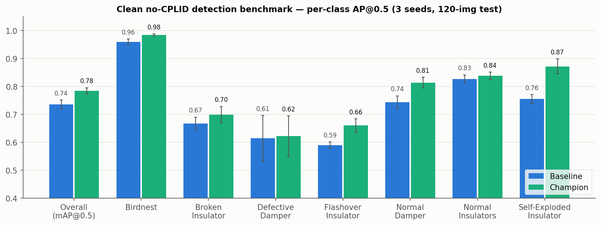

# ATLI — Aerial Transmission-Line Inspection

Training, evaluation, and dataset-rebalancing pipeline for transmission-line defect
detection (YOLOv5/v8/v11 + RT-DETR) on the **ATLI** dataset, with transfer learning
from COCO. Companion code to the APET 2025 paper *T0388 — Autonomous Transmission Line
Inspection using Transfer Learning Enhanced Deep Learning Models* (Tsai et al.).

> **Funding:** NSF grant no. 1950872 and the UNLV AI SUSTEIN Seed Grant.

## Current benchmarks

Clean (decontaminated) test split, seed-averaged. Best benchmark model: **mAP@0.5 0.802 ±
0.015** (YOLOv11n @1280, ×3 oversampling + scale-aug, train-only CPLID restore). Full model
registry with per-class metrics and reproduction commands: [`models/`](models/); dataset
composition + augmentation method: [`results/dataset_augmentation_summary.md`](results/dataset_augmentation_summary.md).



## Repo layout

```
env/         build_env.sh            conda env: torch 2.6+cu118, YOLOv5, Ultralytics 8.4.9
data/        build_dataset.py        rebuild the stratified merged dataset from Roboflow
             build_ablation.py       ablation dataset builders
             build_condition_*.py    per-condition (c/d/e/f/g/g2) dataset variants
             explore_roboflow.py     read-only Roboflow workspace inventory
train/       run_config*.sh          single-config train drivers (base/v2/v3/single/clswt/rtdetr)
             sweep*.sh, *_sweep.sh    multi-config sweeps (ablation, cond c–h, rtdetr, hr_stack)
             rerun_failed.sh         re-launch failed configs
eval/        eval_all.sh, *_eval.sh  evaluation drivers
             parse_results.py        scrape runs/ -> results.csv
analysis/    pi_summary_charts.py    summary figures
             hard_negatives/         confusion mining (mine.sh + visualize.py)
             notebooks/              merging_datasets.ipynb, benchmark_repro.ipynb
rebalance/   phase1_select.py        zoomed-out defective-insulator rebalancing (see its README)
             phase2_upload.py
results/     benchmark_results.md, results.csv, figures/
scripts/     check_status*.sh        monitor remote runs from your laptop
```

**Not in git** (see `.gitignore`): `.env`, `datasets/`, `runs/`, `*.pt` weights, the
conda env, and the paper PDF. These are large and/or regenerable — rebuild them with the
scripts below rather than committing them.

## Setup

```bash
# 1. Roboflow credentials — never commit the real key
cp .env.example .env          # then paste your PRIVATE key from
                              # https://app.roboflow.com/tl-target-set-focus/settings/api

# 2. Environment (CUDA box)
bash env/build_env.sh         # creates the conda env (torch 2.6+cu118, yolov5, ultralytics)

# 3. Rebuild the dataset from Roboflow (downloads merged_atli_target v4 +
#    eduardos-annotated-photos v1, applies the seed-42 stratified split)
python data/build_dataset.py
```

The dataset is **not** shipped in this repo — `data/build_dataset.py` pulls it from the
Roboflow `tl-target-set-focus` workspace. Anyone with a workspace API key can regenerate
a byte-identical class distribution (split *membership* is seed-42 deterministic).

## Reproduce a run

```bash
bash train/run_config.sh <config>     # train one config
bash train/sweep.sh                   # or a full sweep
bash eval/eval_all.sh                 # evaluate -> writes results/results.csv
python eval/parse_results.py          # summarize
```

Key results to date live in `results/benchmark_results.md`. Best reproduced test
mAP@0.5: **v8n + SGD @ 150ep = 0.707**.

## Working on the GPU server (for teammates)

Code is shared through git; **data, runs, and weights stay on the server** (too large to
commit, fully regenerable). The server is the GPU box `$ATLI_SERVER` (real address in the
untracked `.env`, 8× Quadro RTX 6000); each person works from their own clone:

```bash
ssh $ATLI_SERVER
git clone <repo-url> ~/atli-inspection
cd ~/atli-inspection
cp .env.example .env && $EDITOR .env   # paste your Roboflow key
bash env/build_env.sh                  # one-time env build
python data/build_dataset.py           # rebuilds ~/atli/Merged_Dataset_Stratified
bash train/sweep.sh                    # outputs land in runs/ (git-ignored)
```

Pull before each session (`git pull`); push script changes back so everyone shares one
source of truth instead of loose copies in `$HOME`. Trained weights worth sharing should
go to a GitHub Release attachment or the Roboflow model registry — **not** git.

> Scripts assume an `$HOME/atli` working tree on the server (dataset, `runs/`, `eval/`).
> Adjust the `ROOT` variable at the top of the `*.sh` drivers if your layout differs.

## Citation

Tsai, O., et al. *Autonomous Transmission Line Inspection using Transfer
Learning Enhanced Deep Learning Models.* APET 2025, paper T0388.
