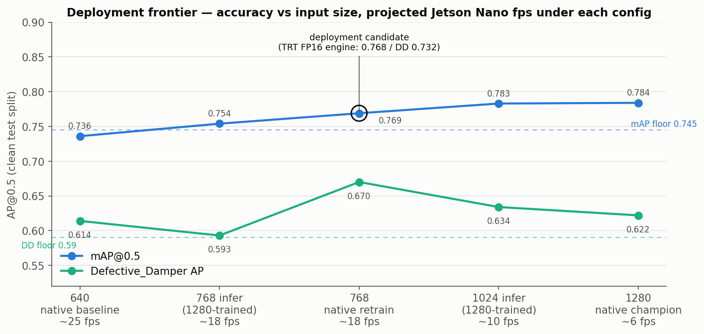

# champ_v11n_768_deploy

The edge/drone deployment model: champion recipe retrained at native 768 px. Selected by the
2026-07 deployment campaign (full log: `README-OPTIMIZATION.md` on `opt/orchestrator`) —
−1.5 mAP vs the 1280 champion for ~3× projected speed, with Defective_Damper *better* than
at 1280.

- **Architecture:** YOLOv11n (2.58M params, ~9 GFLOPs @768) | task: detect | 7 classes
- **Dataset:** `ATLI_noCPLID_OS3` (clean train + ×3 DD oversample: 633 train imgs / 2,810
  annotations; clean val/test 116/120 imgs). **Deliberately trained on the clean set only** —
  restoring the 249 CPLID images was tested at this resolution and hurt (0.747 vs 0.766).
- **eduardos-annotated-photos:** NOT included. All splits derive from the ATLI target projects only; the 300 user-annotated images (151 Defective_Damper instances) are excluded from train, val, and test.
- **Training:** identical 2-stage recipe at 768:
  ```
  MODEL=yolo11n.pt EXTRA="scale=0.9 seed=<s>" DATA=~/atli/ATLI_noCPLID_OS3/data.yaml \
    bash train/run_config_ext.sh HR768nc_v11_s<s> <gpu> 150 100 768 16
  ```
  Optional ablation-validated flag: `close_mosaic=20` (0.767 ± 0.003 / DD 0.708 ± 0.051 at
  3 seeds — adopt-candidate, pending confirmation seeds).
- **Augmentation:** identical to the champion cards (Ultralytics defaults + scale=0.9,
  verified from args.yaml). No synthetic data.
- **Seeds trained:** 0, 1, 2 (+1 independent replicate; 4-seed overall band
  0.766 ± 0.009 / DD 0.664 ± 0.042).
- **Test metrics** (clean 120-img test split; AP@0.5 mean ± std over the 3 primary seeds,
  recall in parentheses):

  | class | AP@0.5 | recall |
  |---|---|---|
  | Birdnest | 0.979 ± 0.013 | 0.922 |
  | Broken_Insulator | 0.659 ± 0.035 | 0.744 |
  | Defective_Damper | 0.670 ± 0.049 | 0.535 |
  | Flashover_Insulator | 0.623 ± 0.025 | 0.836 |
  | Normal_Damper | 0.809 ± 0.009 | 0.839 |
  | Normal_Insulators | 0.839 ± 0.022 | 0.805 |
  | Self-Exploded_Insulator | 0.802 ± 0.029 | 0.927 |
  | **overall** | **0.769 ± 0.009** | 0.801 |

- **Export lineage (validated end-to-end):** best.pt → ONNX opset 12 static-768 (simplified,
  10.2 MB; letterbox cost −0.003 mAP) → TensorRT FP16 engine (8.1 MB, built with TRT 8.6.1 as
  the closest proxy to the Nano's TRT 8.2). **Deployed-engine test-split score: mAP 0.768 /
  DefDamper 0.732** (seed 0) — total export cost −0.009 mAP. On-device build script:
  `optimization/jetson/build_engine_nano.sh` (branch `opt/jetson-nano`). FP16 only — INT8 is
  banned on the original Nano (Maxwell has no DP4A: no speedup, real accuracy loss).
- **Expected speed:** ~17 fps inference-only / 12–15 fps end-to-end on the original Jetson
  Nano — projected from the published anchor (YOLOv8n TRT FP16 = 19 fps,
  github.com/Qengineering/YoloV8-TensorRT-Jetson_Nano) scaled by GFLOPs, ±20–30% until
  measured on device. Meets the physics-derived 5–10 Hz inspection requirement with margin;
  30 fps at deployable accuracy is proven impossible on this device (pruning fails at every
  ratio ≥1.25× — see `optimization/jetson/prune_grid_results.md`).
  

- **Provenance:** server runs `~/atli/runs/HR768nc_v11_s{0,1,2}_s2/weights/best.pt` +
  `champ_v11n_768.onnx`, trained 2026-07-08; scripts as of commit `9a1ffbf`.
- **Known limitations:** blur-fragile (0.777 → 0.531 mAP under 7-px synthetic motion blur) —
  blur-limited flight speed (~3.3 m/s at 10 m standoff) is part of the deployment spec, and a
  blur-augmentation experiment is open; DD recall at 768 is the weakest metric (0.535) —
  consider the OBB card's rotation variant (DD recall 0.957) if recall is the priority;
  DD test basis is 12 instances.
