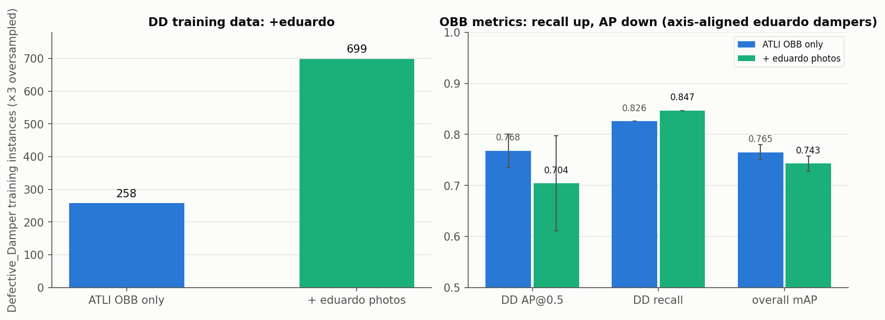

# obb_champ_eduardo_1280

OBB champion trained on the ATLI OBB dataset **combined with eduardo's annotated photos**
(damper + insulator boxes from `eduardos-annotated-photos` v4). Goal: increase the
Defective_Damper training count. Evaluated on the same clean 107-image OBB test set, so
directly comparable to `obb_champ_v11n_1280`.

- **Architecture:** YOLOv11n-OBB | task: obb (rotated boxes, rotated-IoU) | 7 classes
- **eduardos-annotated-photos: INCLUDED** (v4, `yolov8-obb` export, 280 imgs, 0 leaked into
  clean val/test). This is the first model that includes them.
- **Dataset:** `ATLI_OBB_eduardo_OS3` = `ATLI_noCPLID_OBB` train + gated eduardo v4 OBB imgs,
  ×3 DD oversample. Train **1,224 imgs**. DD instances **258 → 699**; ND → 2,476.
  Genuine oriented (rotated) boxes: Normal_Insulators 215, Normal_Damper 64, Defective_Damper 6
  — the rest (incl. all eduardo dampers and the Broken/Flashover/Self-Exploded insulators) are
  axis-aligned, i.e. valid but zero-rotation OBB labels. val/test = clean ATLI OBB (unchanged).
- **Training:**
  `MODEL=yolo11n-obb.pt EXTRA="scale=0.9 seed=<s>" DATA=~/atli/ATLI_OBB_eduardo_OS3/data.yaml bash train/run_config_obb.sh OBBed_v11_s<s> <gpu> 150 100 1280 16`
  (2-stage TL: 150 ep lr0=0.01 → 100 ep lr0=0.00334/lrf=0.1535). Augmentation: defaults + scale=0.9. No synthetic data.
- **Seeds:** 0, 1, 2.
- **Test metrics** (clean 107-img OBB test; AP@0.5 mean ± std, 3 seeds):

  | class | AP@0.5 | recall | vs prior OBB champ (no eduardo) |
  |---|---|---|---|
  | Birdnest | 0.914 ± 0.011 | 0.851 | −0.036 |
  | Broken_Insulator | 0.762 ± 0.075 | 0.803 | −0.084 |
  | Defective_Damper | 0.704 ± 0.093 | **0.847** | AP −0.064 / **recall +0.021** |
  | Flashover_Insulator | 0.680 ± 0.005 | 0.806 | −0.001 |
  | Normal_Damper | 0.751 ± 0.007 | 0.825 | −0.016 |
  | Normal_Insulators | 0.731 ± 0.041 | 0.763 | +0.007 |
  | Self-Exploded_Insulator | 0.660 ± 0.045 | 0.802 | +0.039 |
  | **overall** | **0.743 ± 0.015** | 0.814 | −0.022 |

- **Finding:** adding ~150 eduardo Defective_Damper images **raised DD recall (0.826 → 0.847)**
  — the model catches more defects — but **DD AP dropped (0.768 → 0.704)** and overall mAP
  slipped. Likely cause: eduardo dampers are axis-aligned, but the OBB test set has oriented
  dampers scored by rotated-IoU, so box-orientation precision suffers. The extra data helped
  *detection*, the axis-aligned labels hurt *oriented-box precision*. If OBB is the direction,
  the dampers should be drawn as true polygons (instance-segmentation project) to remove this.
- **Provenance:** server runs `~/atli/runs/OBBed_v11_s{0,1,2}_s2/weights/best.pt`, trained
  2026-07-13; dataset `~/atli/ATLI_OBB_eduardo_OS3`.
- **Known limitations:** eduardo dampers axis-aligned (0 of 147 DD, 6 of 765 ND rotated);
  Broken/Flashover/Self-Exploded insulators have no oriented ground truth; DD test basis is
  16 OBB-split instances (±0.09 spread — directional).

## Data change and results

