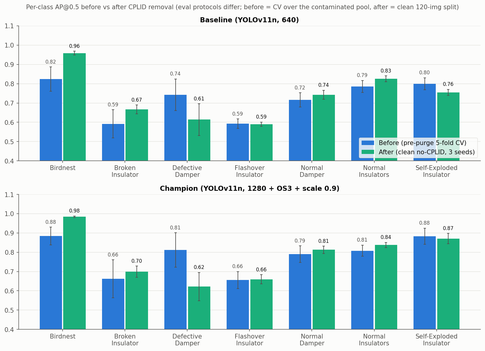

# CPLID Removal: Clean Benchmark, Removed Images, Before/After (2026-07-08)

## Clean-data detection benchmark

`ATLI_target_tightNI_noCPLID` (797 imgs, 561/116/120 split, 120-img test), YOLOv11n,
2-stage TL, 3 seeds each. Baseline = 640 px. Champion = 1280 px + DD ×3 oversample + scale=0.9.

| class | baseline | champion | Δ AP |
|---|---|---|---|
| Birdnest | 0.959 ± 0.010 | 0.984 ± 0.004 | +0.025 |
| Broken_Insulator | 0.667 ± 0.023 | 0.699 ± 0.029 | +0.032 |
| Defective_Damper | 0.614 ± 0.082 | 0.622 ± 0.073 | +0.008 |
| Flashover_Insulator | 0.590 ± 0.011 | 0.660 ± 0.024 | +0.070 |
| Normal_Damper | 0.743 ± 0.023 | 0.813 ± 0.019 | +0.070 |
| Normal_Insulators | 0.826 ± 0.015 | 0.838 ± 0.013 | +0.012 |
| Self-Exploded_Insulator | 0.755 ± 0.016 | 0.871 ± 0.027 | +0.116 |
| **overall (mAP@0.5)** | **0.736 ± 0.015** | **0.784 ± 0.011** | **+0.048** |

Per-class AP on the clean test set, baseline (blue) vs champion (green), error bars = seed std:

## Removed CPLID images

249 images removed from ATLI (171 train / 41 val / 37 test). Annotation content of those
249 images (image counts in parentheses); every removed image carries one
Self-Exploded_Insulator:

| class | instances | on images |
|---|---|---|
| Self-Exploded_Insulator | 249 | 249 |
| Normal_Damper | 277 | 72 |
| Normal_Insulators | 30 | 12 |
| Birdnest | 6 | 6 |
| Defective_Damper | 3 | 3 |
| Broken_Insulator | 0 | 0 |
| Flashover_Insulator | 0 | 0 |

## Before vs after CPLID removal, all classes

Before = pre-purge proper 5-fold CV (contaminated pool). After = clean no-CPLID single split
(3 seeds). Eval protocols and test sets differ; compare shapes, not exact values.

| class | baseline before | baseline after | champion before | champion after |
|---|---|---|---|---|
| Birdnest | 0.824 ± 0.063 | 0.959 ± 0.010 | 0.884 ± 0.046 | 0.984 ± 0.004 |
| Broken_Insulator | 0.592 ± 0.073 | 0.667 ± 0.023 | 0.662 ± 0.099 | 0.699 ± 0.029 |
| Defective_Damper | 0.743 ± 0.082 | 0.614 ± 0.082 | 0.812 ± 0.089 | 0.622 ± 0.073 |
| Flashover_Insulator | 0.593 ± 0.024 | 0.590 ± 0.011 | 0.656 ± 0.044 | 0.660 ± 0.024 |
| Normal_Damper | 0.716 ± 0.037 | 0.743 ± 0.023 | 0.790 ± 0.043 | 0.813 ± 0.019 |
| Normal_Insulators | 0.786 ± 0.031 | 0.826 ± 0.015 | 0.808 ± 0.029 | 0.838 ± 0.013 |
| Self-Exploded_Insulator | 0.800 ± 0.031 | 0.755 ± 0.016 | 0.883 ± 0.042 | 0.871 ± 0.027 |
| **overall (mAP@0.5)** | **0.722 ± 0.022** | **0.736 ± 0.015** | **0.785 ± 0.026** | **0.784 ± 0.011** |

Grouped bars per class, before (blue) vs after (green); top panel baseline, bottom panel
champion:

