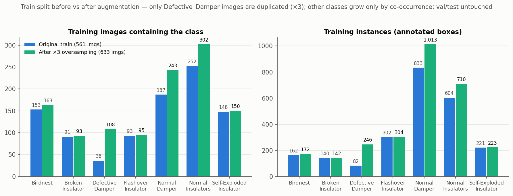
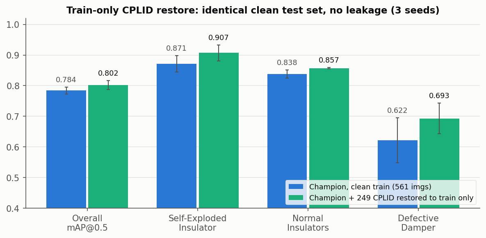

# Dataset & Augmentation Summary — ATLI clean benchmark

Self-contained reference for the dataset behind the current model cards (`models/`): how many
images each category has, what the train/val/test split is, and exactly what "augmentation"
means in this project. All counts below were computed directly from the dataset label files
on the training server (`~/atli/ATLI_target_tightNI_noCPLID` and `~/atli/ATLI_noCPLID_OS3`),
not copied from memory.

## Dataset

`ATLI_target_tightNI_noCPLID` — the ATLI transmission-line defect dataset after the
2026-07-07 CPLID decontamination (audit trail: `results/cplid_purge_roboflow.md`), with
hand-tightened Normal_Insulators boxes. 7 categories, real UAV/RGB photos only.

**797 images total, split 561 train / 116 val / 120 test (70/15/15, the original paper split).**

| split | images | annotations | share |
|---|---:|---:|---:|
| train | 561 | 2,344 | 70.4% |
| val | 116 | 506 | 14.6% |
| test | 120 | 467 | 15.1% |

## Per-category counts — original vs. after augmentation

Augmentation changes the dataset on disk in exactly one way: every **training** image that
contains at least one `Defective_Damper` box is duplicated ×3 (script pattern
`data/build_oversample_native.py`, output dataset `ATLI_noCPLID_OS3`). Because those images
also contain other objects (mostly dampers and insulators on the same tower), the co-occurring
categories grow a little too. **Val and test are never augmented or oversampled** — they stay
byte-identical to the original split, so all evaluation numbers are on untouched real data.

"Images" = number of images containing at least one box of that category (an image with
several categories is counted once per category); "instances" = number of annotated boxes.

| category | train images (orig → aug) | train instances (orig → aug) | val images | val inst. | test images | test inst. |
|---|---:|---:|---:|---:|---:|---:|
| Birdnest | 153 → 163 | 162 → 172 | 35 | 37 | 32 | 36 |
| Broken_Insulator | 91 → 93 | 140 → 142 | 19 | 28 | 20 | 26 |
| **Defective_Damper** | **36 → 108** | **82 → 246** | 6 | 16 | 7 | 12 |
| Flashover_Insulator | 93 → 95 | 302 → 304 | 22 | 60 | 19 | 72 |
| Normal_Damper | 187 → 243 | 833 → 1,013 | 45 | 207 | 37 | 144 |
| Normal_Insulators | 252 → 302 | 604 → 710 | 58 | 125 | 53 | 127 |
| Self-Exploded_Insulator | 148 → 150 | 221 → 223 | 27 | 33 | 30 | 50 |
| **total (unique images / boxes)** | **561 → 633** | **2,344 → 2,810** | 116 | 506 | 120 | 467 |

Readout: the target of the oversampling, `Defective_Damper` (the rarest and hardest
category), goes from 36 to 108 training images and 82 to 246 boxes; every other category
changes only through co-occurrence on the duplicated images. The test set still has only
12 Defective_Damper instances, so per-run DD metrics carry ±0.05–0.08 spread — results are
always reported as multi-seed means.

*(regenerate: `python3 results/figures/generate_dataset_summary.py`)*

## Which image sources went into training

Everything below refers to the current model cards. ✅ = images are in the training set,
❌ = not used anywhere in the model.

| image source | in train | in val/test | why |
|---|:---:|:---:|---|
| ATLI target (`merged_atli_target`, tightened-NI, post-purge) | ✅ | ✅ | the native dataset — all 797 images above come from here |
| COCO (Microsoft) | ✅* | ❌ | *weights only — models start from COCO-pretrained checkpoints; no COCO images enter the dataset |
| CPLID (600 public insulator photos) | ❌ / ✅** | ❌ | removed 2026-07-07 (duplicated into the old test set — leakage); **restored to train ONLY in the `champ_v11n_1280_cplid_restore` variant, test stays clean |
| eduardos-annotated-photos (300 images, 151 Defective_Damper) | ❌ | ❌ | excluded from every current model; largest untapped DD source — leakage-gated train-only merge is the planned experiment |
| Roboflow Universe damper sets (wangbo, yolov11-tasks — 2,175 imgs) | ❌ | ❌ | tested at every dose, never improved Defective_Damper (domain/label-style mismatch) — rejected |
| DVDI (public damper dataset) | ❌ | ❌ | rejected before any use: ~50% of it already inside ATLI, harvesting it would leak eval images into train |

## Performance

Effect of the full recipe (×3 oversampling + hi-res 1280 + scale=0.9) vs the plain baseline,
per class, on the identical untouched 120-image test split (3 seeds each):

The train-only CPLID restore (the ✅** row above) on the same clean test set — the current
best benchmark model:

## Methods

**No synthetic data is used anywhere.** Two mechanisms only (full explainer:
`models/README.md`):

1. **Image-level oversampling (offline, table above).** To be precise about what gets
   duplicated — it is **NOT all images, and NOT ×3 of the whole dataset**:
   - Only **training** images that contain **at least one `Defective_Damper` box** are
     affected. Every other training image appears exactly once.
   - Each such image ends up **3 copies total** (the original + 2 byte-identical
     duplicates), labels copied along with it.
   - The arithmetic: of the 561 training images, **36** contain a Defective_Damper box;
     36 × 2 extra copies = 72 added images → **633** training images. That is why other
     categories grow only slightly in the table above — they gain counts only when they
     happen to sit on the same photo as a defective damper (e.g. normal dampers on the
     same tower).
   - **Val and test are never oversampled** — evaluation always runs on the original,
     untouched images.
   The copies are byte-identical; they become useful because of mechanism 2 (each copy is
   randomly transformed differently every epoch, so the network effectively sees the rare
   class ~3× as often, each time with a different view). Ablation-validated: worth
   **+0.07 Defective_Damper AP** over a no-oversampling control; ×6 duplication overfits,
   ×3 is the recipe.
2. **Online augmentation (on-the-fly, adds nothing to disk).** Every image is passed through
   a fresh random transform each time it is loaded, so the model never sees identical pixels
   twice across a 250-epoch run, but every pixel originates in a real photo. Exact
   configuration (Ultralytics defaults except `scale`): hsv_h 0.015, hsv_s 0.7, hsv_v 0.4,
   degrees 0, translate 0.1, **scale 0.9 (overridden; ablation sweet spot, default 0.5)**,
   shear 0, perspective 0, flipud 0, fliplr 0.5, mosaic 1.0, close_mosaic 10, mixup 0,
   copy_paste 0, erasing 0.4.

**Training method, end to end** (the "champion" configuration used by the current model
cards):

1. **Build the dataset** — the clean 561/116/120 split above.
2. **Oversample the train split only** — duplicate the 36 Defective_Damper training images
   to 3 copies each (561 → 633 images). Val/test untouched.
3. **Stage 1 (transfer learning):** start from COCO-pretrained YOLOv11n weights and train
   150 epochs on the oversampled train split — SGD, lr0 = 0.01, image size 1280, batch 16.
   The online augmentation (mechanism 2 above, `scale=0.9`) is applied on the fly to every
   training batch in this and the next stage; it is never applied at evaluation time.
4. **Stage 2 (fine-tune):** continue from stage-1's best checkpoint for 100 more epochs at
   a much lower learning rate (lr0 = 0.00334, lrf = 0.1535, OneCycle).
5. **Evaluate** on the untouched 120-image test split — original images, no duplication,
   no augmentation.

Repeated with ≥3 random seeds; all reported numbers are seed means ± std. Exact
reproduction commands, per-class metrics, and provenance for each trained model are in the
individual cards under `models/<name>/README.md`.

**Effect of the augmentation** (3 seeds each, identical clean test split): baseline without
oversampling/hi-res = mAP@0.5 0.736 ± 0.015 (Defective_Damper AP 0.614) → with the recipe
above = **0.784 ± 0.011 (Defective_Damper AP 0.622)**; full before/after analysis in
`results/cplid_before_after.md` and `results/pi_summary_2026-07-08.md`.

**eduardos-annotated-photos: NOT included** in any split of this dataset or any current model
(see `models/README.md` for what that set contains and the planned leakage-gated experiment).
