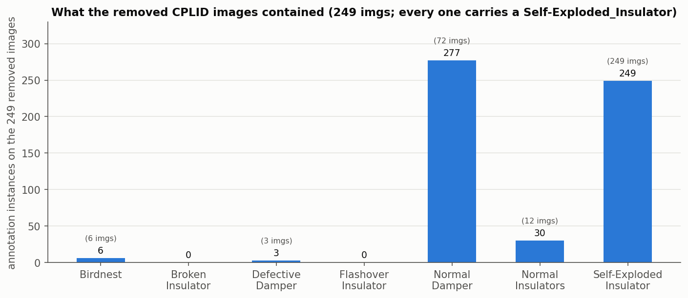
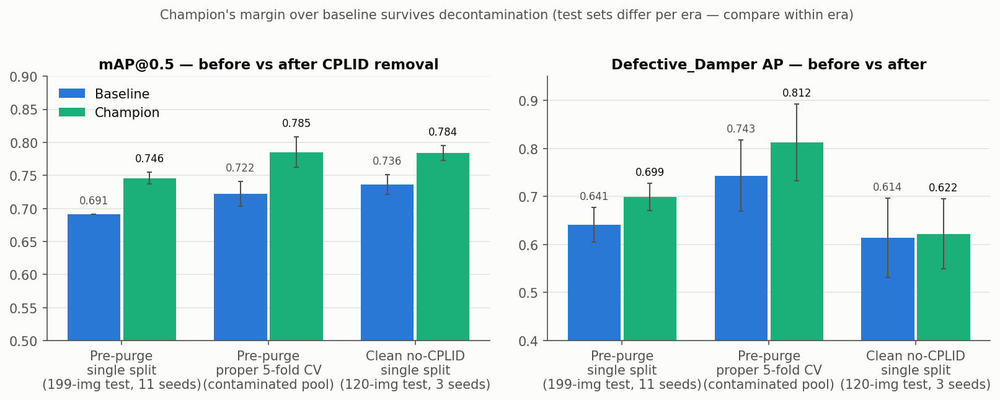
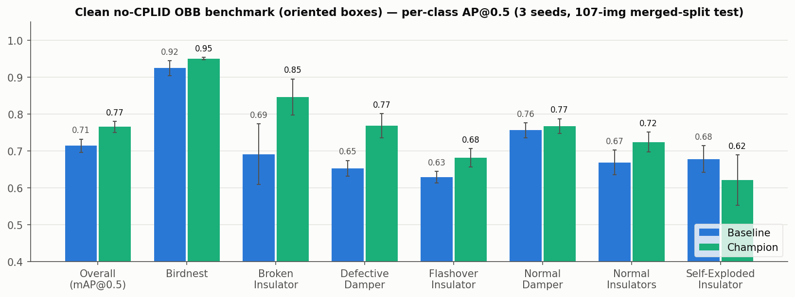

# Research Update: CPLID Decontamination & Edge-Deployment Study (2026-07-08)

## Part 1: CPLID findings

CPLID duplicates found (pHash-verified):

| location | CPLID duplicates |
|---|---|
| `atli_source_dataset` (11,294 imgs) | 599 (525 exact) |
| ATLI target (1,046 imgs) | 249: 171 train / 41 val / 37 test |
| `atli_target-minus-the-cplid` (1,037 imgs) | 241 still present |

Removals (2026-07-07, pre/post versions frozen on Roboflow):

| project | before | after |
|---|---|---|
| `atli_source_dataset` | 11,294 | 10,698 |
| `atli_target-train` | 732 | 561 |
| `atli_target-val` | 157 | 116 |
| `atli_target-test` | 157 | 120 |
| `atli_target-minus-the-cplid` | 1,037 | 796 |

What the 249 removed images contained (instances per class; image counts in parentheses).
Every removed image carries one Self-Exploded_Insulator; Normal_Dampers co-occur on 72 of them:

## Clean-data detection benchmark

`ATLI_target_tightNI_noCPLID` (797 imgs, 561/116/120 split), YOLOv11n, 2-stage TL, 3 seeds each.
Baseline = 640 px. Champion = 1280 px + DD ×3 oversample + scale=0.9.

| class | baseline | champion | Δ AP |
|---|---|---|---|
| Birdnest | 0.959 ± 0.010 | 0.984 ± 0.004 | +0.025 |
| Broken_Insulator | 0.667 ± 0.023 | 0.699 ± 0.029 | +0.032 |
| Defective_Damper | 0.614 ± 0.082 | 0.622 ± 0.073 | +0.008 |
| Flashover_Insulator | 0.590 ± 0.011 | 0.660 ± 0.024 | +0.070 |
| Normal_Damper | 0.743 ± 0.023 | 0.813 ± 0.019 | +0.070 |
| Normal_Insulators | 0.826 ± 0.015 | 0.838 ± 0.013 | +0.012 |
| Self-Exploded_Insulator | 0.755 ± 0.016 | 0.871 ± 0.027 | +0.116 |
| **overall (mAP@0.5)** | **0.736 ± 0.015** | **0.784 ± 0.011** | **+0.048** |

Grouped bars, baseline (blue) vs champion (green), across three benchmark eras. Left panel
mAP@0.5, right panel Defective_Damper AP. Test sets differ per era; compare within era.

| era | protocol | baseline v11n | champion v11n |
|---|---|---|---|
| pre-purge single split (199-img test) | 11 seeds | mAP 0.691 / DD 0.641 ± 0.036 | mAP 0.746 ± 0.009 / DD 0.699 ± 0.028 |
| pre-purge proper 5-fold CV | 5 folds | mAP 0.722 ± 0.019 / DD 0.743 ± 0.074 | mAP 0.785 ± 0.023 / DD 0.812 ± 0.080 |
| clean no-CPLID single split (120-img test) | 3 seeds | mAP 0.736 ± 0.015 / DD 0.614 ± 0.082 | mAP 0.784 ± 0.011 / DD 0.622 ± 0.073 |

Per-class AP on the clean test set, baseline vs champion, error bars = seed std:

## OBB benchmark (oriented bounding boxes)

`atli_target-minus-the-cplid` v2 (82 oriented Normal_Damper boxes), YOLOv11n-OBB, 107-img test
(different split; compare within this table only), 3 seeds each:

| class | baseline OBB (640) | champion OBB (1280+OS3+scale) | Δ AP |
|---|---|---|---|
| Birdnest | 0.924 ± 0.020 | 0.950 ± 0.003 | +0.026 |
| Broken_Insulator | 0.691 ± 0.082 | 0.846 ± 0.049 | +0.155 |
| Defective_Damper | 0.653 ± 0.021 | 0.768 ± 0.033 | +0.115 |
| Flashover_Insulator | 0.629 ± 0.016 | 0.681 ± 0.025 | +0.052 |
| Normal_Damper | 0.756 ± 0.020 | 0.767 ± 0.020 | +0.011 |
| Normal_Insulators | 0.669 ± 0.033 | 0.724 ± 0.027 | +0.055 |
| Self-Exploded_Insulator | 0.678 ± 0.036 | 0.621 ± 0.068 | −0.057 |
| **overall (mAP@0.5)** | **0.714 ± 0.018** | **0.765 ± 0.015** | **+0.051** |

Same layout as the detection chart, for the rotated-box task:

## Part 2: Edge deployment

Gates: G1 export (ONNX to TRT FP16 + parity) · G2 >=30 fps projected on original Jetson Nano ·
G3 <2 GB memory · G4 accuracy (mAP >=0.745 and DefDamper >=0.59).

| gate | status |
|---|---|
| G1 export | PASSED: TRT FP16 engine (8.1 MB), parity −0.009 mAP |
| G2 throughput | OPEN: ~18 fps @768; ~30 if 1.75× prune holds (grid running) |
| G3 memory | PROVISIONAL PASS: 8.1 MB engine + ~0.6-0.8 GB CUDA context |
| G4 accuracy | PASSED: native-768 and the deployed engine clear both floors |

Resolution ladder (3 seeds; fps projected from the measured 19-fps YOLOv8n anchor,
github.com/Qengineering/YoloV8-TensorRT-Jetson_Nano, scaled by GFLOPs, ±20-30%):

| deploy config | mAP@0.5 | DefDamper AP | projected Nano fps |
|---|---|---|---|
| 1280 native (champion) | 0.784 | 0.622 | ~6 |
| 1024 infer | 0.783 | 0.634 | ~10 |
| 768 infer | 0.754 | 0.593 | ~18 |
| **768 native retrain** | **0.769 ± 0.009** | **0.670 ± 0.049** | ~18 |
| 640 native baseline | 0.736 | 0.614 | ~25 |

Line chart of the table above: mAP (blue) and DefDamper AP (green) per config, accuracy floors
dashed, deployment candidate circled:

TensorRT FP16 engine validation (deployed artifact, test split): mAP 0.768 / DefDamper 0.732
(PyTorch: 0.777 / 0.725).

Other results:

| experiment | result |
|---|---|
| In-domain source pretraining (srcTL) | −7.5 mAP; genuine negative transfer (source pool: 45.3% tower/line boxes, single capture campaign, 2 classes absent) |
| Low-LR stage-2 (lr0=1e-4) | wash at 1 seed; more seeds running |
| Pruning, gentle-LR recovery | missed: 1.5× prune = 0.609 mAP / DD 0.501 |
| Pruning, high-LR recovery | running (decides G2) |
| Motion blur 7-px (eval-only) | 0.777 to 0.531 mAP (−0.246) |
| Gaussian blur σ=2 (eval-only) | 0.442 mAP |
| Test-time augmentation | +0.002 mAP; rejected |

Deployment decision (memo: `optimization/jetson/decision_memo.md`): coverage math gives ~26
sightings per component per pass at 5 Hz, so 5-10 Hz is the real requirement.

| option | cost | result |
|---|---|---|
| rescope to 5-10 Hz, original Nano | $0 | 768 px at ~18 fps, 2-3× the requirement |
| Orin Nano Super | $249 | full 1280 at 30+ fps |

## Running now

| experiment | status |
|---|---|
| Augmentation ablation (rotation 10°/45°, mosaic, scale, oversampling variants; 30 runs @768) | running overnight |
| CPLID-train-restore (249 imgs back into train only; CPRest768/1280, 6 runs) | queued |
| Pruning high-LR grid | running |
