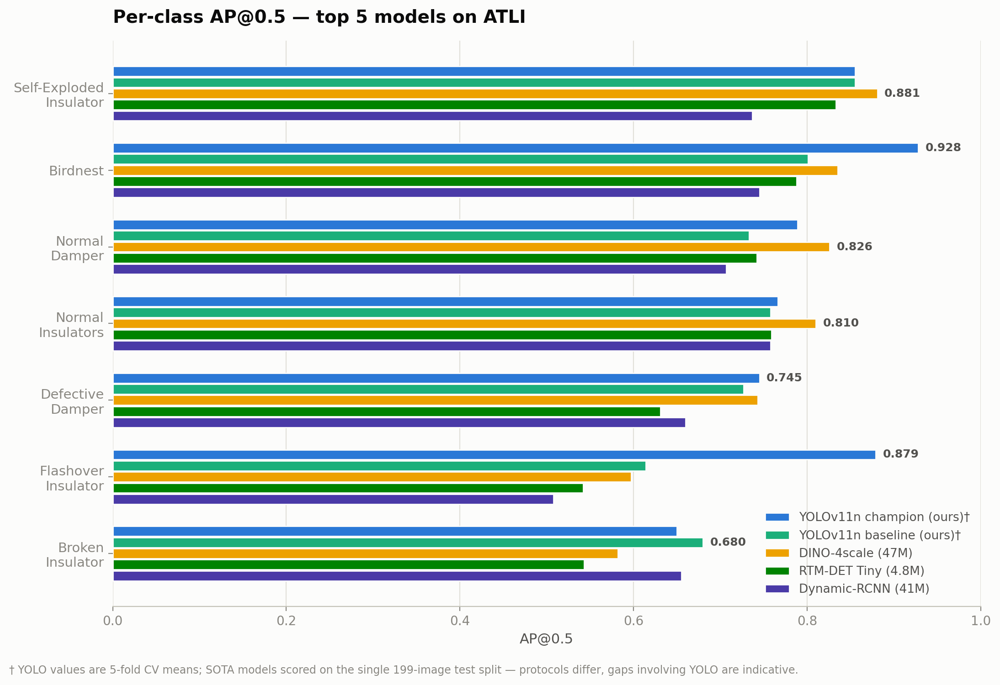
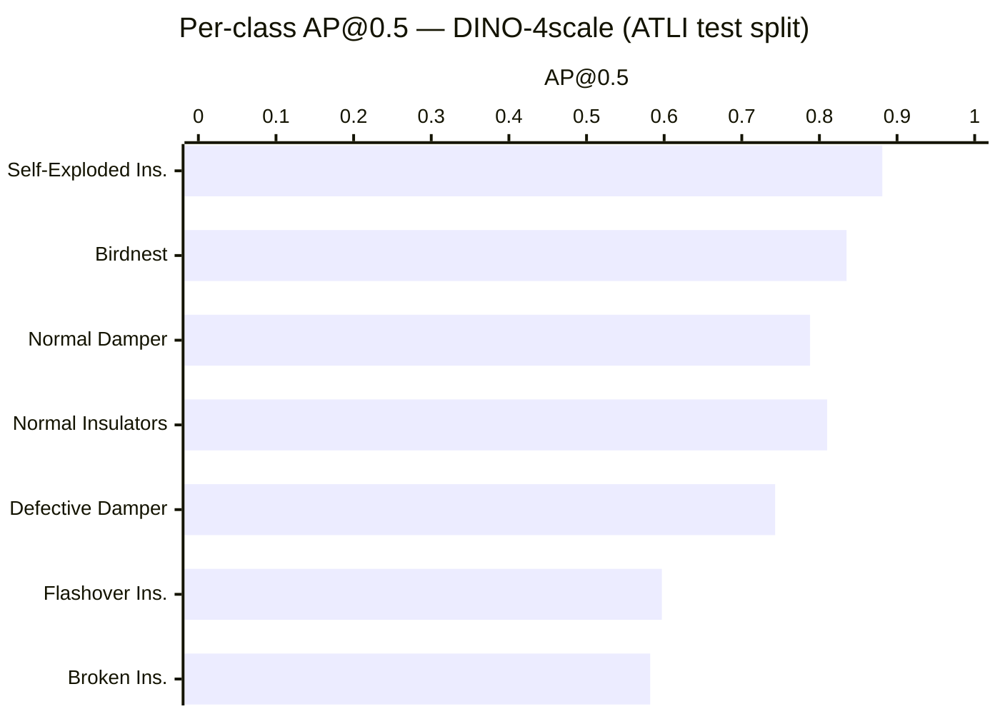

# SOTA Detector Benchmark — Slide Material (week of June 25 – July 1, 2026)

Interactive versions of both figures (screenshot-ready, light/dark):
https://claude.ai/code/artifact/a5d57caa-43e5-4bd5-bb9b-9400a6207f19

---

## Figure 1 — Accuracy vs model size

**Headline: Champion YOLOv11n matches DINO-4scale within 0.6 mAP — at 18× fewer parameters**

ATLI test split (199 images), single split. MMDetection models trained with
COCO-pretrained weights on the same 941/203/199 splits.

| Model | Category | Params | mAP@0.5 | DefDamper AP@0.5 |
|---|---|---:|---:|---:|
| DINO-4scale | Transformer | 47M | **0.753** | **0.743** |
| **YOLOv11n champion (ours)** | One-stage | **2.6M** | 0.747 | 0.699 |
| RTM-DET Tiny | One-stage | 4.8M | 0.691 | 0.631 |
| YOLOv11n baseline (ours) | One-stage | 2.6M | 0.691 | 0.641 |
| Dynamic-RCNN (R50-FPN) | Two-stage | 41M | 0.681 | 0.660 |

```
mAP@0.5
0.76 |                                          ● DINO-4scale (47M, 0.753)
     |  ◉ YOLOv11n champion (2.6M, 0.747) ┄┄┄┄┄┄┘
0.74 |        Δ 0.006 mAP · 18× fewer parameters
     |
0.72 |
     |
0.70 |
     |  ○ YOLOv11n baseline      ● RTM-DET Tiny (4.8M, 0.691)
0.69 |    (2.6M, 0.691)
0.68 |                                       ● Dynamic-RCNN (41M, 0.681)
     +-------------------------------------------------------------
        2M          5M         10M         20M          50M
                        Parameters (log scale)
```

**Talking points**
- DINO tops mAP, but our champion is within 0.6 mAP at 18× fewer parameters —
  far better suited for edge/UAV deployment (the project's stated goal).
- RTM-DET Tiny and Dynamic-RCNN both underperform the champion YOLO recipe.
- DINO's real advantage is localization quality: mAP@0.5:0.95 of 0.461 vs
  0.413 (RTM-DET) / 0.402 (Dynamic-RCNN).
- 5-fold CV for all three SOTA models is running on the server for robust numbers.

---

## Figure 2 — Per-class AP@0.5 (top 5 models)

**Headline: champion YOLO vs SOTA detectors — defect classes stay hardest**



SOTA models: same 199-image test split. YOLO models: 5-fold CV means†.
Values are AP@0.5; mAP@0.5:0.95 in parentheses where available.

| Class | YOLOv11n champ† | YOLOv11n base† | DINO-4scale | RTM-DET Tiny | Dynamic-RCNN |
|---|---:|---:|---:|---:|---:|
| Self-Exploded Insulator | 0.855 | 0.855 | **0.881** (0.651) | 0.833 (0.608) | 0.737 (0.508) |
| Birdnest | **0.928** | 0.801 | 0.835 (0.521) | 0.788 (0.436) | 0.745 (0.471) |
| Normal Damper | 0.789 | 0.733 | **0.826** (0.455) | 0.742 (0.414) | 0.707 (0.388) |
| Normal Insulators | 0.766 | 0.758 | **0.810** (0.463) | 0.759 (0.440) | 0.758 (0.438) |
| Defective Damper | **0.745** | 0.727 | 0.743 (0.322) | 0.631 (0.252) | 0.660 (0.294) |
| Flashover Insulator | **0.879** | 0.614 | 0.597 (0.315) | 0.542 (0.318) | 0.508 (0.287) |
| Broken Insulator | 0.650 | **0.680** | 0.582 (0.500) | 0.543 (0.424) | 0.655 (0.430) |
| **mAP@0.5** | 0.802‡ | 0.760‡ | **0.753** | 0.691 | 0.681 |

† YOLO per-class values are 5-fold CV means (no single-split per-class
breakdown exists) — protocols differ, so cross-model gaps involving YOLO are
indicative, not exact. Regenerate the figure:
`python3 results/figures/generate_sota_perclass.py`.
‡ CV-mean mAP; the champion's *single-split* mAP on the SOTA test split is
0.747 and the baseline's is 0.691 (see Figure 1).



**Talking points**
- DINO wins every class except **Broken Insulator**, where the two-stage
  Dynamic-RCNN wins (0.655).
- The hardest classes for *every* architecture are the defect classes —
  Flashover Insulator (best 0.597) and Broken Insulator (best 0.655) — which
  supports the "more defect data" direction (EPRI IDID, annotation tightening).
- At strict IoU (mAP@0.5:0.95), Defective Damper drops to ~0.32 even for DINO:
  models *find* defective dampers but localize them imprecisely — consistent
  with our small-object findings (hi-res 1280px helps).

**Caveat for the slide:** this figure compares only the three MMDetection
models because they share an identical single test split. Champion YOLO
per-class numbers come from 5-fold CV (different protocol) — don't mix them
into the same chart until the SOTA CV sweep finishes.

---

## Suggested accomplishment bullets

- Benchmarked SOTA detectors via MMDetection (DINO-4scale, RTM-DET,
  Dynamic-RCNN) — champion YOLO within 0.6 mAP of DINO (0.747 vs 0.753) at
  **18× fewer parameters**
- Moved to proper 5-fold CV with separate val/test (70/15/15; previously
  val = test, which biased checkpoint selection)
- Champion recipe validated under the stricter protocol: mAP 0.697 → 0.759,
  Defective-Damper AP 0.695 → **0.801**
- OBB + oversampling all defect classes reached **mAP 0.819** (best condition
  to date; DD AP 0.788)
