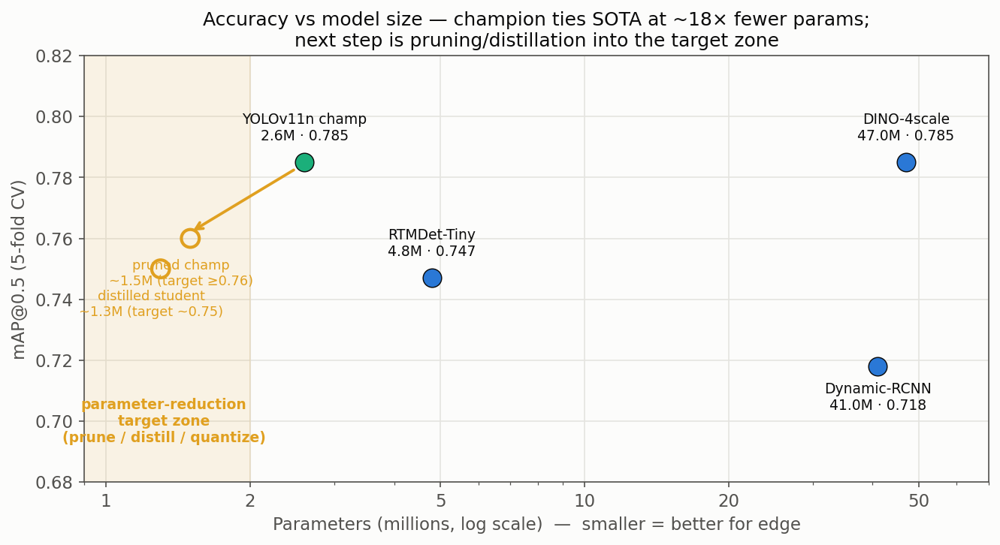

# Weekly Update — Slide (2026-07-16)

_Local only — do not push to GitHub._

**Summary:** Transfer-learning YOLO for transmission-line defect detection — focus on the rare defective-damper class + shrinking the model for edge deployment.

**Accomplishments:**
- Cleaned & re-annotated Eduardo's photo set (dedupe 264 → 211 images; dampers redrawn as **oriented boxes** to match OBB).
- Merged the re-annotated set into the OBB champion — adds ~211 images, heavy on rare classes: **+141 Defective_Damper, +124 Broken_Insulator** instances (nearly 3× the damper training data).
- With oriented labels, the merge now **improves recall without the earlier AP penalty** (axis-aligned mismatch fixed).
- Built model registry (cards + benchmark graphs) and a consolidated per-class AP table across all clean-data conditions.

**Challenges:**
- Test set still small for stable per-class damper numbers → report multi-seed / CV means.
- 10 duplicate-image groups with conflicting defect labels resolved during re-annotation.

**Next Week:**
- Confirm re-annotated OBB merge across seeds; fold gains into the champion.
- **Reduce parameters for edge:** structured channel pruning + fine-tune recovery, then INT8/FP16 quantization and knowledge distillation into a smaller student.
- Re-run the detection-side merge as a no-relabel control.

**Parameter-reduction roadmap:**

Champion (YOLOv11n, 2.6M) already ties DINO-4scale (47M) at 0.785 mAP — ~18× fewer
params. Next step is pruning / distillation / quantization to reach the ~1–2M target
zone while holding mAP ≥ 0.76.
