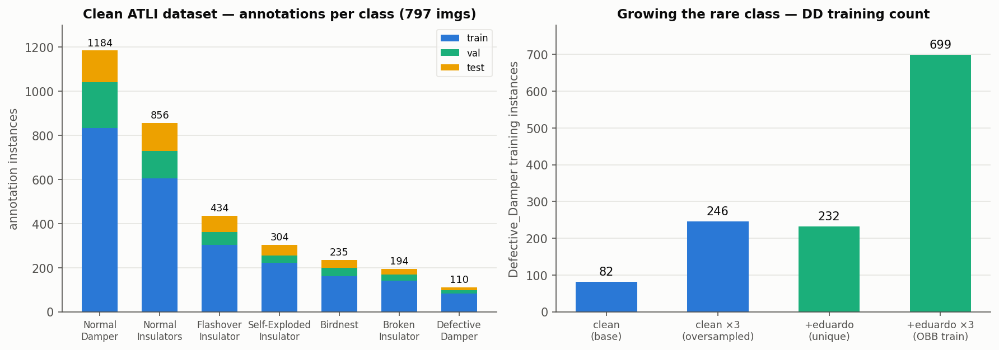

# Weekly Update — 2026-07-14

## Summary

Recovered the training server after a reimage, consolidated all results to GitHub, built a
model registry, and ran the eduardo-photos merge to grow the Defective_Damper class. Headline:
more damper data raised defective-damper **recall** (0.826 to 0.847) but the axis-aligned
annotations hurt oriented-box **AP** — points to needing true polygon annotation for dampers.

## Data



Clean ATLI dataset (`ATLI_target_tightNI_noCPLID`, 797 imgs, 561/116/120 split). Annotation
instances per class (train+val+test), and this week's Defective_Damper training growth.

| class | total | train | val | test |
|---|---|---|---|---|
| Normal_Damper | 1,184 | 833 | 207 | 144 |
| Normal_Insulators | 856 | 604 | 125 | 127 |
| Flashover_Insulator | 434 | 302 | 60 | 72 |
| Self-Exploded_Insulator | 304 | 221 | 33 | 50 |
| Birdnest | 235 | 162 | 37 | 36 |
| Broken_Insulator | 194 | 140 | 28 | 26 |
| **Defective_Damper** | **110** | 82 | 16 | **12** |

Note: oversampling is applied to **train only** — val/test keep their true counts (the test
set really has 12 DD instances, which is why DD metrics carry ±0.05–0.09 seed spread).

### eduardo photos merged (train only, leak-gated)

- 300 photos pHash-gated vs clean val/test: **0 leaked**, all usable.
- Pulled the correct `yolov8-obb` Roboflow export (v4). Checked orientation: only **6 of 765
  Normal_Damper and 0 of 147 Defective_Damper boxes are actually rotated** — the rest are
  axis-aligned. Insulators (Normal_Insulators) carry 215 genuine oriented boxes from ATLI.
- Combined OBB training set: **Defective_Damper 258 → 699 instances** (×3 oversampled).

## Training / benchmarks this week

All 3 seeds, 2-stage transfer learning (150+100 ep), YOLOv11n, scale=0.9, ×3 DD oversample.

### OBB + eduardo photos (new) vs prior OBB champion — same clean OBB test set

| metric | prior OBB champ | + eduardo | change |
|---|---|---|---|
| overall mAP@0.5 | 0.765 ± 0.015 | 0.743 ± 0.015 | −0.022 |
| Defective_Damper AP | 0.768 ± 0.033 | 0.704 ± 0.093 | **−0.064** |
| Defective_Damper recall | 0.826 | 0.847 | **+0.021** |
| Normal_Damper AP | 0.767 | 0.751 | −0.016 |
| Normal_Insulators AP | 0.724 | 0.731 | +0.007 |
| Self-Exploded AP | 0.621 | 0.660 | +0.039 |

**Finding:** the extra data made the model *catch* more defective dampers (recall up), but
the axis-aligned labels hurt oriented-box precision (AP down) because the test set is scored
with rotated-IoU. To get an AP gain under OBB, dampers need true polygon annotation.

### Best models to date (for reference)

| model | task | mAP@0.5 | DD AP | notes |
|---|---|---|---|---|
| CPLID-restore 1280 | detection | 0.802 ± 0.015 | 0.693 | best benchmark |
| clean champion 1280 | detection | 0.784 ± 0.011 | 0.622 | reference |
| 768 deploy | detection | 0.769 ± 0.009 | 0.670 | edge model |
| OBB champion | OBB | 0.765 ± 0.015 | 0.768 | best OBB DD |
| OBB + eduardo | OBB | 0.743 ± 0.015 | 0.704 | this week |

(Detection and OBB use different test splits — compare within task only.)

## GitHub organization

Repo: `github.com/eduardoloz/atli-inspection` (private). Shared with soummm101 (write).

```
atli-inspection/
├── GITHUB_HANDOFF.md          one-page repo orientation
├── GIT.md                     commit/branch/model-card conventions + privacy rules
├── CLAUDE.md                  full experiment log
├── models/                    trained-model registry (one folder per model)
│   ├── README.md              registry table + augmentation explainer + dataset table
│   ├── champ_v11n_1280_clean/          README.md = model card
│   ├── champ_v11n_1280_cplid_restore/  (best benchmark, 0.802)
│   ├── champ_v11n_768_deploy/          (edge model + TensorRT lineage)
│   ├── obb_champ_v11n_1280/            (OBB champion)
│   └── obb_champ_eduardo_1280/         (this week's eduardo OBB merge)
├── results/
│   ├── evals/                 all-conditions eval tables (per-class, labeled by test set)
│   ├── figures/               generated charts + generator script
│   ├── pi_summary_2026-07-08.md
│   └── cplid_*.md, weekly_update_*.md
├── data/  train/  eval/  rebalance/  optimization/   pipeline code
└── (branches)
    ├── main                   validated work
    ├── exp/eduardo-merge      this week's eduardo experiment + its model card
    └── opt/{orchestrator,jetson-nano,thesis-enhancements}   deployment campaign
```

Each model folder's `README.md` is a full card: exact reproduction command, dataset splits
with per-class annotation counts, augmentation config, per-class metrics ± std, provenance,
and whether eduardo's photos were included.

## Next / open

- Run the same eduardo merge in **plain detection mode** (axis-aligned eval) to measure the
  pure "more DD data" effect without the orientation penalty.
- For true OBB gains: annotate dampers as polygons in an instance-segmentation project.
- 5-fold CV on the clean pool to tighten the noisy DD numbers (12-instance test set).
