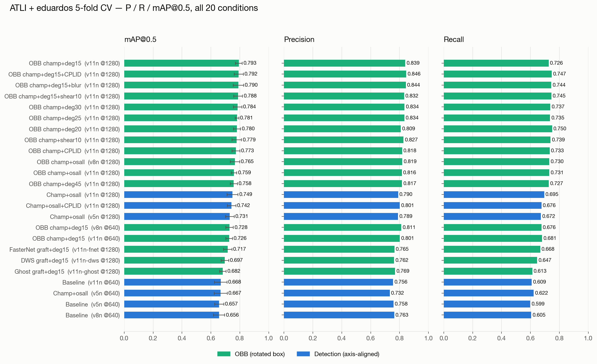
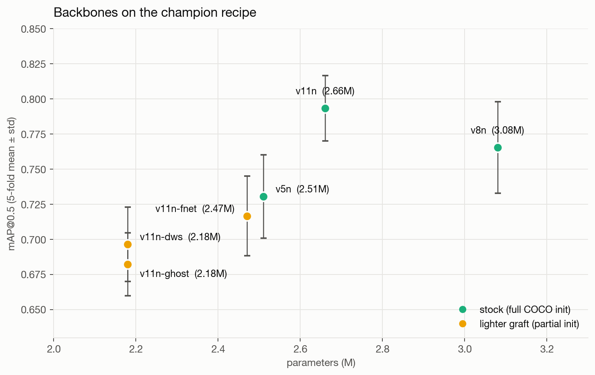
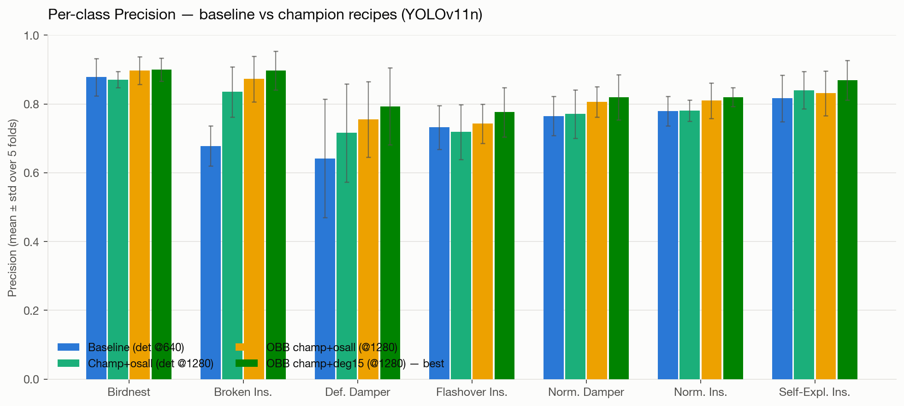
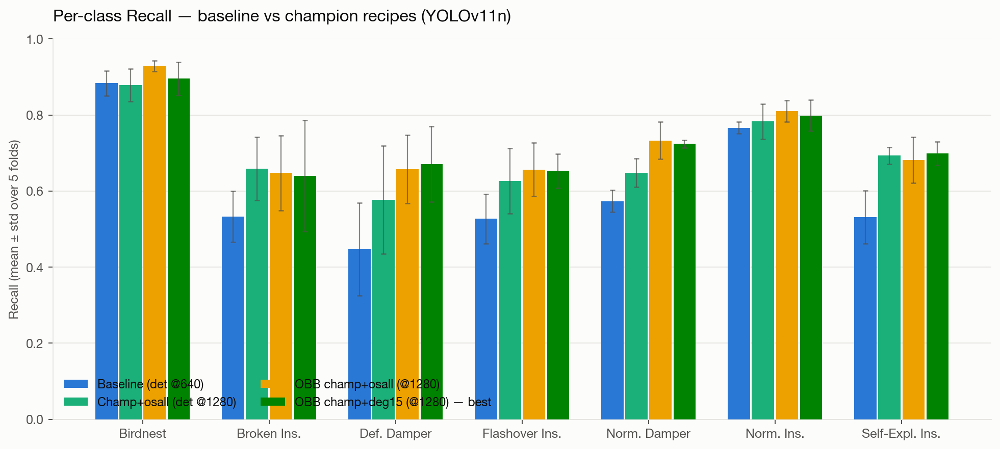
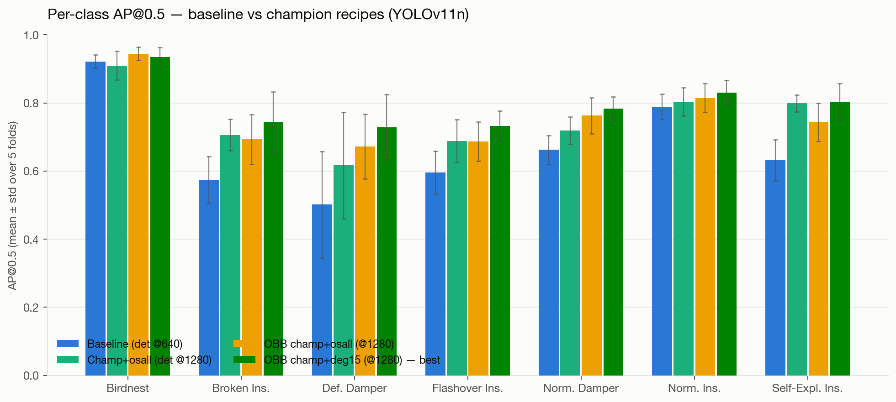

# Weekly update — 2026-07-22: eduardo-CV campaign (phases 2-6 complete)

All numbers are **5-fold group-aware CV** on the 974-img ATLI(no-CPLID)+eduardos
pool — mean ± std across folds, held-out test split per fold. Recipes:
`train/sweep_eduardo*.sh`; raw numbers: `results/eval_eduardo_results.json` +
`results/eval_blur_robustness.json`.

## All conditions — P / R / mAP@0.5 (sorted by mAP)

| condition | model | task | imgsz | params | P | R | mAP@0.5 |
|---|---|---|--:|--:|--:|--:|--:|
| OBB champ+deg15 | v11n | OBB | 1280 | 2.66M | 0.839 | 0.726 | **0.793** ± 0.023 |
| OBB champ+deg15+CPLID | v11n | OBB | 1280 | 2.66M | 0.846 | 0.747 | **0.792** ± 0.031 |
| OBB champ+deg15+blur | v11n | OBB | 1280 | 2.66M | 0.844 | 0.744 | **0.790** ± 0.035 |
| OBB champ+deg15+shear10 | v11n | OBB | 1280 | 2.66M | 0.832 | 0.745 | **0.788** ± 0.030 |
| OBB champ+deg30 | v11n | OBB | 1280 | 2.66M | 0.834 | 0.737 | **0.784** ± 0.029 |
| OBB champ+deg25 | v11n | OBB | 1280 | 2.66M | 0.834 | 0.735 | **0.781** ± 0.013 |
| OBB champ+deg20 | v11n | OBB | 1280 | 2.66M | 0.809 | 0.750 | **0.780** ± 0.024 |
| OBB champ+shear10 | v11n | OBB | 1280 | 2.66M | 0.827 | 0.739 | **0.779** ± 0.033 |
| OBB champ+CPLID | v11n | OBB | 1280 | 2.66M | 0.818 | 0.733 | **0.773** ± 0.027 |
| OBB champ+osall | v8n | OBB | 1280 | 3.08M | 0.819 | 0.730 | **0.765** ± 0.033 |
| OBB champ+osall | v11n | OBB | 1280 | 2.66M | 0.816 | 0.731 | **0.759** ± 0.019 |
| OBB champ+deg45 | v11n | OBB | 1280 | 2.66M | 0.817 | 0.727 | **0.758** ± 0.025 |
| Champ+osall | v11n | det | 1280 | 2.59M | 0.790 | 0.695 | **0.749** ± 0.038 |
| Champ+osall+CPLID | v11n | det | 1280 | 2.59M | 0.801 | 0.676 | **0.742** ± 0.030 |
| Champ+osall | v5n | det | 1280 | 2.51M | 0.789 | 0.672 | **0.731** ± 0.030 |
| OBB champ+deg15 | v8n | OBB | 640 | 3.08M | 0.811 | 0.676 | **0.728** ± 0.026 |
| OBB champ+deg15 | v11n | OBB | 640 | 2.66M | 0.801 | 0.681 | **0.726** ± 0.023 |
| FasterNet graft+deg15 | v11n-fnet | OBB | 1280 | 2.47M | 0.765 | 0.668 | **0.717** ± 0.028 |
| DWS graft+deg15 | v11n-dws | OBB | 1280 | 2.18M | 0.762 | 0.647 | **0.697** ± 0.026 |
| Ghost graft+deg15 | v11n-ghost | OBB | 1280 | 2.18M | 0.769 | 0.613 | **0.682** ± 0.022 |
| Baseline | v11n | det | 640 | 2.59M | 0.756 | 0.609 | **0.668** ± 0.043 |
| Champ+osall | v5n | det | 640 | 2.51M | 0.732 | 0.622 | **0.667** ± 0.046 |
| Baseline | v5n | det | 640 | 2.51M | 0.758 | 0.599 | **0.657** ± 0.031 |
| Baseline | v8n | det | 640 | 3.01M | 0.763 | 0.605 | **0.656** ± 0.039 |

## Backbone comparison (champion-tier recipe, params included)

Stock zoo backbones (full COCO init) vs lighter grafts built this week:

| backbone | params | GFLOPs | recipe | P | R | mAP@0.5 |
|---|--:|--:|---|--:|--:|--:|
| v11n | 2.66M | 6.7 | OBB champ+deg15 | 0.839 | 0.726 | **0.793** ± 0.023 |
| v8n | 3.08M | 8.4 | OBB champ+osall | 0.819 | 0.730 | **0.765** ± 0.033 |
| v5n | 2.51M | 7.2 | Champ+osall | 0.789 | 0.672 | **0.731** ± 0.030 |
| v11n-fnet | 2.47M | 7.0 | FasterNet graft+deg15 | 0.765 | 0.668 | **0.717** ± 0.028 |
| v11n-dws | 2.18M | 5.3 | DWS graft+deg15 | 0.762 | 0.647 | **0.697** ± 0.026 |
| v11n-ghost | 2.18M | 5.8 | Ghost graft+deg15 | 0.769 | 0.613 | **0.682** ± 0.022 |

## Blur robustness (result of the week)

| model | clean mAP | 7px-blurred mAP | penalty |
|---|--:|--:|--:|
| deg15 (champion) | 0.793 | 0.466 ± 0.050 | -0.328 |
| deg15 + blur-aug | 0.790 | 0.678 ± 0.038 | -0.112 |

Train-time MotionBlur/GaussianBlur buys **+0.21 mAP under motion blur at zero
clean-test cost** — recommended deployment recipe for UAV footage.

## Per-class P / R / mAP — all conditions (mean over folds)

Table cells are **P / R / AP@0.5** per class:

| condition | model | Birdnest | Broken Ins. | Def. Damper | Flashover Ins. | Norm. Damper | Norm. Ins. | Self-Expl. Ins. |
|---|---|--:|--:|--:|--:|--:|--:|--:|
| OBB champ+deg15 | v11n | 0.90 / 0.90 / 0.93 | 0.90 / 0.64 / 0.74 | 0.79 / 0.67 / 0.73 | 0.78 / 0.65 / 0.73 | 0.82 / 0.72 / 0.78 | 0.82 / 0.80 / 0.83 | 0.87 / 0.70 / 0.80 |
| OBB champ+deg15+CPLID | v11n | 0.90 / 0.94 / 0.95 | 0.85 / 0.66 / 0.75 | 0.83 / 0.70 / 0.76 | 0.83 / 0.67 / 0.72 | 0.83 / 0.70 / 0.76 | 0.83 / 0.82 / 0.82 | 0.85 / 0.73 / 0.78 |
| OBB champ+deg15+blur | v11n | 0.90 / 0.92 / 0.94 | 0.85 / 0.67 / 0.74 | 0.84 / 0.70 / 0.74 | 0.80 / 0.64 / 0.69 | 0.84 / 0.70 / 0.77 | 0.84 / 0.81 / 0.83 | 0.83 / 0.77 / 0.82 |
| OBB champ+deg15+shear10 | v11n | 0.90 / 0.93 / 0.95 | 0.86 / 0.66 / 0.73 | 0.80 / 0.70 / 0.72 | 0.77 / 0.68 / 0.73 | 0.81 / 0.72 / 0.77 | 0.82 / 0.82 / 0.83 | 0.85 / 0.70 / 0.78 |
| OBB champ+deg30 | v11n | 0.93 / 0.91 / 0.96 | 0.81 / 0.67 / 0.72 | 0.82 / 0.66 / 0.72 | 0.81 / 0.67 / 0.73 | 0.82 / 0.72 / 0.78 | 0.82 / 0.81 / 0.83 | 0.83 / 0.72 / 0.76 |
| OBB champ+deg25 | v11n | 0.91 / 0.93 / 0.95 | 0.91 / 0.68 / 0.75 | 0.79 / 0.68 / 0.71 | 0.74 / 0.65 / 0.70 | 0.82 / 0.73 / 0.77 | 0.83 / 0.83 / 0.84 | 0.83 / 0.66 / 0.74 |
| OBB champ+deg20 | v11n | 0.89 / 0.93 / 0.95 | 0.85 / 0.68 / 0.71 | 0.78 / 0.67 / 0.72 | 0.73 / 0.69 / 0.71 | 0.78 / 0.75 / 0.77 | 0.80 / 0.82 / 0.82 | 0.84 / 0.72 / 0.78 |
| OBB champ+shear10 | v11n | 0.90 / 0.95 / 0.95 | 0.87 / 0.68 / 0.74 | 0.83 / 0.66 / 0.72 | 0.76 / 0.65 / 0.71 | 0.82 / 0.72 / 0.77 | 0.80 / 0.83 / 0.83 | 0.80 / 0.68 / 0.74 |
| OBB champ+CPLID | v11n | 0.88 / 0.93 / 0.95 | 0.81 / 0.66 / 0.72 | 0.79 / 0.63 / 0.68 | 0.74 / 0.62 / 0.68 | 0.81 / 0.74 / 0.78 | 0.83 / 0.81 / 0.82 | 0.87 / 0.73 / 0.78 |
| OBB champ+osall | v8n | 0.90 / 0.92 / 0.94 | 0.87 / 0.65 / 0.69 | 0.76 / 0.64 / 0.71 | 0.73 / 0.66 / 0.68 | 0.82 / 0.71 / 0.75 | 0.81 / 0.81 / 0.82 | 0.85 / 0.72 / 0.76 |
| OBB champ+osall | v11n | 0.90 / 0.93 / 0.94 | 0.87 / 0.65 / 0.69 | 0.76 / 0.66 / 0.67 | 0.74 / 0.66 / 0.69 | 0.81 / 0.73 / 0.76 | 0.81 / 0.81 / 0.81 | 0.83 / 0.68 / 0.74 |
| OBB champ+deg45 | v11n | 0.91 / 0.92 / 0.92 | 0.78 / 0.67 / 0.70 | 0.79 / 0.61 / 0.65 | 0.77 / 0.65 / 0.70 | 0.81 / 0.71 / 0.75 | 0.82 / 0.81 / 0.82 | 0.83 / 0.71 / 0.75 |
| Champ+osall | v11n | 0.87 / 0.88 / 0.91 | 0.83 / 0.66 / 0.71 | 0.72 / 0.58 / 0.62 | 0.72 / 0.63 / 0.69 | 0.77 / 0.65 / 0.72 | 0.78 / 0.78 / 0.80 | 0.84 / 0.69 / 0.80 |
| Champ+osall+CPLID | v11n | 0.88 / 0.86 / 0.90 | 0.78 / 0.63 / 0.67 | 0.76 / 0.55 / 0.64 | 0.73 / 0.62 / 0.68 | 0.80 / 0.64 / 0.73 | 0.81 / 0.78 / 0.80 | 0.84 / 0.66 / 0.77 |
| Champ+osall | v5n | 0.83 / 0.86 / 0.89 | 0.80 / 0.63 / 0.68 | 0.73 / 0.48 / 0.56 | 0.73 / 0.66 / 0.71 | 0.79 / 0.64 / 0.71 | 0.80 / 0.75 / 0.79 | 0.84 / 0.69 / 0.78 |
| OBB champ+deg15 | v8n | 0.89 / 0.88 / 0.93 | 0.84 / 0.56 / 0.63 | 0.79 / 0.61 / 0.63 | 0.76 / 0.60 / 0.66 | 0.81 / 0.68 / 0.73 | 0.81 / 0.75 / 0.80 | 0.78 / 0.66 / 0.72 |
| OBB champ+deg15 | v11n | 0.88 / 0.91 / 0.92 | 0.81 / 0.56 / 0.60 | 0.78 / 0.58 / 0.63 | 0.75 / 0.60 / 0.67 | 0.79 / 0.70 / 0.74 | 0.80 / 0.78 / 0.81 | 0.79 / 0.65 / 0.72 |
| FasterNet graft+deg15 | v11n-fnet | 0.87 / 0.90 / 0.91 | 0.74 / 0.52 / 0.62 | 0.74 / 0.62 / 0.68 | 0.72 / 0.61 / 0.63 | 0.78 / 0.66 / 0.73 | 0.78 / 0.78 / 0.80 | 0.72 / 0.59 / 0.65 |
| DWS graft+deg15 | v11n-dws | 0.85 / 0.89 / 0.89 | 0.77 / 0.51 / 0.63 | 0.74 / 0.55 / 0.60 | 0.75 / 0.59 / 0.62 | 0.75 / 0.64 / 0.71 | 0.78 / 0.78 / 0.80 | 0.70 / 0.56 / 0.62 |
| Ghost graft+deg15 | v11n-ghost | 0.86 / 0.87 / 0.91 | 0.68 / 0.49 / 0.57 | 0.83 / 0.50 / 0.60 | 0.76 / 0.50 / 0.58 | 0.76 / 0.62 / 0.70 | 0.77 / 0.78 / 0.80 | 0.73 / 0.53 / 0.61 |
| Baseline | v11n | 0.88 / 0.88 / 0.92 | 0.68 / 0.53 / 0.57 | 0.64 / 0.45 / 0.50 | 0.73 / 0.53 / 0.60 | 0.76 / 0.57 / 0.66 | 0.78 / 0.77 / 0.79 | 0.82 / 0.53 / 0.63 |
| Champ+osall | v5n | 0.80 / 0.82 / 0.88 | 0.70 / 0.51 / 0.58 | 0.68 / 0.51 / 0.52 | 0.69 / 0.55 / 0.58 | 0.73 / 0.57 / 0.64 | 0.78 / 0.74 / 0.76 | 0.76 / 0.66 / 0.72 |
| Baseline | v5n | 0.83 / 0.84 / 0.88 | 0.66 / 0.46 / 0.52 | 0.68 / 0.41 / 0.51 | 0.79 / 0.55 / 0.59 | 0.74 / 0.58 / 0.66 | 0.77 / 0.76 / 0.78 | 0.83 / 0.59 / 0.66 |
| Baseline | v8n | 0.85 / 0.88 / 0.91 | 0.70 / 0.47 / 0.53 | 0.72 / 0.47 / 0.49 | 0.75 / 0.52 / 0.57 | 0.77 / 0.59 / 0.68 | 0.78 / 0.75 / 0.77 | 0.78 / 0.56 / 0.65 |

## Per-class P / R / AP@0.5 — key conditions (detailed)

### Baseline (v11n det @640) — mAP 0.668 ± 0.043

| class | P | R | AP@0.5 |
|---|--:|--:|--:|
| Birdnest | 0.878 | 0.883 | 0.922 ± 0.020 |
| Broken Ins. | 0.678 | 0.532 | 0.574 ± 0.068 |
| Def. Damper | 0.642 | 0.446 | 0.501 ± 0.156 |
| Flashover Ins. | 0.732 | 0.527 | 0.596 ± 0.063 |
| Norm. Damper | 0.765 | 0.573 | 0.662 ± 0.042 |
| Norm. Ins. | 0.779 | 0.766 | 0.789 ± 0.037 |
| Self-Expl. Ins. | 0.816 | 0.531 | 0.632 ± 0.060 |

### Champ+osall (v11n det @1280) — mAP 0.749 ± 0.038

| class | P | R | AP@0.5 |
|---|--:|--:|--:|
| Birdnest | 0.871 | 0.878 | 0.910 ± 0.042 |
| Broken Ins. | 0.835 | 0.658 | 0.706 ± 0.046 |
| Def. Damper | 0.716 | 0.577 | 0.617 ± 0.156 |
| Flashover Ins. | 0.719 | 0.627 | 0.688 ± 0.063 |
| Norm. Damper | 0.771 | 0.648 | 0.719 ± 0.040 |
| Norm. Ins. | 0.781 | 0.783 | 0.803 ± 0.041 |
| Self-Expl. Ins. | 0.840 | 0.693 | 0.799 ± 0.025 |

### OBB champ+osall (v11n OBB @1280) — mAP 0.759 ± 0.019

| class | P | R | AP@0.5 |
|---|--:|--:|--:|
| Birdnest | 0.897 | 0.929 | 0.944 ± 0.020 |
| Broken Ins. | 0.872 | 0.648 | 0.693 ± 0.073 |
| Def. Damper | 0.755 | 0.657 | 0.672 ± 0.095 |
| Flashover Ins. | 0.743 | 0.657 | 0.687 ± 0.058 |
| Norm. Damper | 0.806 | 0.733 | 0.763 ± 0.052 |
| Norm. Ins. | 0.809 | 0.810 | 0.814 ± 0.042 |
| Self-Expl. Ins. | 0.831 | 0.682 | 0.743 ± 0.056 |

### OBB champ+deg15 (v11n OBB @1280) — mAP 0.793 ± 0.023

| class | P | R | AP@0.5 |
|---|--:|--:|--:|
| Birdnest | 0.900 | 0.895 | 0.935 ± 0.028 |
| Broken Ins. | 0.897 | 0.640 | 0.743 ± 0.090 |
| Def. Damper | 0.793 | 0.671 | 0.729 ± 0.096 |
| Flashover Ins. | 0.776 | 0.653 | 0.732 ± 0.044 |
| Norm. Damper | 0.819 | 0.724 | 0.783 ± 0.035 |
| Norm. Ins. | 0.820 | 0.799 | 0.830 ± 0.036 |
| Self-Expl. Ins. | 0.869 | 0.699 | 0.803 ± 0.054 |

### OBB champ+deg15+blur (v11n OBB @1280) — mAP 0.790 ± 0.035

| class | P | R | AP@0.5 |
|---|--:|--:|--:|
| Birdnest | 0.897 | 0.917 | 0.940 ± 0.029 |
| Broken Ins. | 0.848 | 0.673 | 0.736 ± 0.059 |
| Def. Damper | 0.844 | 0.704 | 0.741 ± 0.092 |
| Flashover Ins. | 0.803 | 0.635 | 0.693 ± 0.065 |
| Norm. Damper | 0.842 | 0.696 | 0.773 ± 0.031 |
| Norm. Ins. | 0.838 | 0.812 | 0.832 ± 0.021 |
| Self-Expl. Ins. | 0.835 | 0.772 | 0.816 ± 0.078 |

## This week's other findings

- **CPLID-in-train does not compose with deg15** (0.792 vs 0.793).
  - Proof — per-fold mAP@0.5 on the same 5 folds: deg15 = [0.811, 0.800, 0.750, 0.815, 0.792]
    (mean 0.793 ± 0.023) vs deg15+CPLID = [0.748, 0.819, 0.777, 0.783, 0.836] (0.792 ± 0.031).
    Paired per-fold delta (CPLID − deg15) = [-0.063, +0.019, +0.027, -0.032, +0.044], mean **−0.001**: the
    sign flips fold to fold, so the difference is within fold noise — no gain
    from adding the 249 CPLID images once deg15 rotation is in the recipe.
- Mild rotation (deg15–30) is what pushes DefDamper AP past 0.7; deg45 gives it back.
